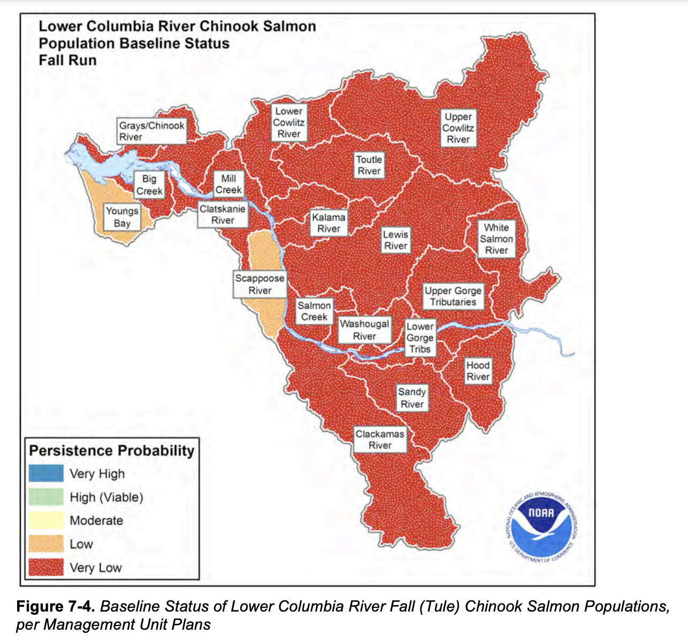

```{r message=FALSE}
library(tidyverse)
options(dplyr.summarise.inform = FALSE)
```

For this lab you will use multivariate auto-regressive state-space (MARSS) to analyze multivariate salmon data from the Columbia River. These data are noisy and gappy. They are estimates of total spawner abundance and might include hatchery spawners.

## Teams

1. Lower Columbia River Chinook: Zoe Rand (QERM), Emma Timmins-Schiffman (Genome Sci), Maria Kuruvilla (QERM)
2. Lower Columbia River Steelhead: Eric French (Civil), Liz Elmstrom (SAFS), Terrance Wang (SAFS)
3. Lower Columbia River Coho: Nick Chambers (SAFS), Karl Veggerby (SAFS), Miranda Mudge (Molecular & Cellular)
4. Upper and Middle Columbia River Steelhead: Madison Shipley (SAFS), Josh Zahner (SAFS), Dylan Hubl (Env & Forest Sci)

## Lower Columbia River salmon spawner data

These data are from the [Coordinated Assessments Partnership (CAP) ](https://www.streamnet.org/cap/about-cap/) and downloaded using the [rCAX R client](https://nwfsc-math-bio.github.io/rCAX/) for the CAX (the CAP database) API. The data are saved in `Lab-2/Data_Images/columbia-river.rda`.

```{r}
load(here::here("Lab-2", "Data_Images", "columbia-river.rda"))
```

The data set has data for fi endangered and threatened ESU (Evolutionary Significant Units) in the Lower Columbia River.
```{r}
esu <- unique(columbia.river$esu_dps)
esu
```

```{r echo=FALSE, out.width="50%", fig.cap="Figure from ESA recovery plan for Lower Columbia River Coho salmon, Lower Columbia River Chinook salmon, Columbia River Chum salmon, and Lower Columbia River steelhead. 2013. NMFS NW Region.  https://repository.library.noaa.gov/view/noaa/16002"}

```

```{r echo=FALSE, out.width="50%", fig.cap="Figure from 2022 5-Year Review: Summary & Evaluation of Upper Columbia River Spring-run Chinook Salmon and Upper Columbia River Steelhead. NMFS. West Coast Region. https://doi.org/10.25923/p4w5-dp31"}
knitr::include_graphics("Data_Images/UCR-Steelhead-regions.png")
```

### Data structure

The dataset has the following columns
```{r}
colnames(columbia.river)
```
* species: Chinook, Coho, Steelhead
* esu_dps: name of the ESU
* majorpopgroup: biological major group
* commonpopname: common population name, generally a stream or river
* run: run-timing
* spawningyear: the year that the spawners were counted on the spawning grounds
* value: total (natural-born and hatchery-born) spawners on the spawning ground. Generally some type of redd-count expansion or some other stream count of spawners. Redd = a gravel nest.

### Data plots

Let's load one ESU and make a plot. Create a function.
```{r}
plotesu <- function(esuname){
  df <- columbia.river %>% subset(esu_dps %in% esuname)
ggplot(df, aes(x=spawningyear, y=log(value), color=majorpopgroup)) + 
  geom_point(size=0.2, na.rm = TRUE) + 
  theme(strip.text.x = element_text(size = 3)) +
  theme(axis.text.x = element_text(size = 5, angle = 90)) +
  facet_wrap(~esapopname) +
  ggtitle(paste0(esuname, collapse="\n"))
}
```

```{r}
plotesu(esu[3])
```

```{r}
plotesu(esu[4])
```

```{r}
plotesu(esu[5])
```

```{r}
plotesu(esu[1:2])
```

```{r}
df <- columbia.river %>% subset(species == "Chinook salmon")
ggplot(df, aes(x=spawningyear, y=log(value), color=run)) + 
  geom_point(size=0.2, na.rm = TRUE) +
  theme(strip.text.x = element_text(size = 3)) +
  theme(axis.text.x = element_text(size = 5, angle = 90)) + 
  facet_wrap(~esapopname)
```

## Tackle one (or more) of these tasks

### Create estimates of spawner abundance for all missing years and provide estimates of the decline from the historical abundance.

**Tips**

You can assume that `R="diagonal and equal"` and `A="scaling"`. Assume that "historical" means the earliest years available for your group.

**States**

Your abundance estimate is the "x" or "state" estimates. You can get this from
```
fit$states
```
or 
```
tsSmooth(fit)
```
where `fit` is from `fit <- MARSS()`

* Describe your assumptions about the x and how the data time series are related to x.

   - How are the x and y (data) related? 1 x for 1 y or will you assume 1 x for all y or 1 x for each major population group? How will you choose?
   - What will you assume about the U for the x's?
   - What will you assume about the Q matrix?
   
"Compare the accuracy of total abundance forecasts using ARIMA models for Bristol Bay sockeye rivers and compare to the AKFW and UW FRI forecasts."

"Compare the accuracy of age-group forecasts using ARIMA models for Bristol Bay sockeye and compare to the AKFW and UW FRI forecasts."

"Use the Ruggerone & Irvine data and ARIMA models to study the autoregressive structure of pink, chum and sockeye. Are there differences by region (AK verus E Asia)?"

"Compare the forecasts of total North Pacific pink and chum using 5, 10, 15, and 20 years of training data. Does forecast accuracy increase with more training data?"

"Create 1-year forecasts of total North Pacific pink salmon using 20 years of training data for all of the Ruggerone and Irvine data. Is forecast error correlated with the PDO?"

## Resources

Chapter 7 MARSS models. ATSA Lab Book. <https://atsa-es.github.io/atsa-labs/chap-mss.html>

Chapter 8 MARSS models with covariate. ATSA Lab Book. <https://atsa-es.github.io/atsa-labs/chap-msscov.html>

Chapter 16 Modeling cyclic sockeye <https://atsa-es.github.io/atsa-labs/chap-cyclic-sockeye.html>
