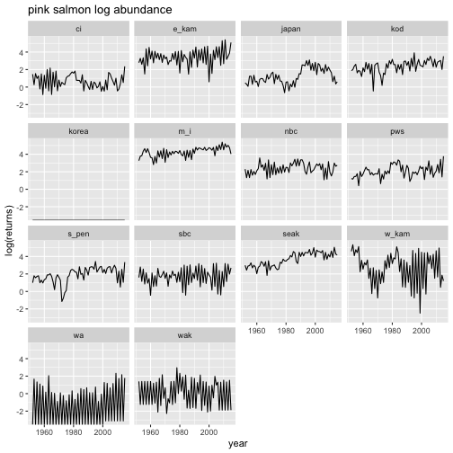
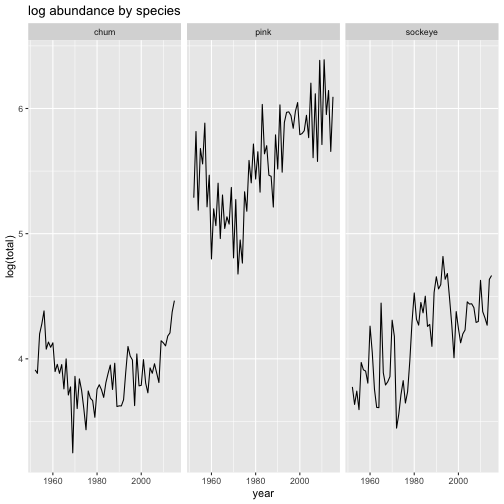
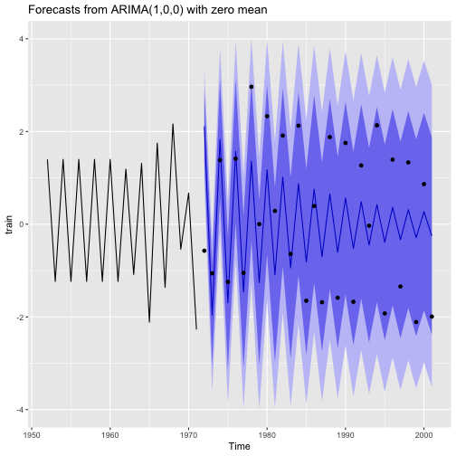

For this lab you will use the material you have learned in the first 3 lectures to explore features of time series of salmon in the North Pacific (Alaska and E Asia). Then you will use ARIMA models to create forecasts and ask a research question with those forecasts.

## References

Holmes, E. E. (2020) Fisheries Catch Forecasting <https://fish-forecast.github.io/Fish-Forecast-Bookdown>

Hyndman, R.J., & Athanasopoulos, G. (2018) Forecasting: principles and practice, 2nd edition, OTexts: Melbourne, Australia. <https://otexts.com/fpp2/>.

Plus the lecture material on the ATSA website.

## Type of questions you might ask

"Compare the accuracy of forecasts using best fit ARIMA models for pink salmon using the different regions in the Ruggerone & Irvine data. Is forecast accuracy is different for different regions?"

"Compare the accuracy of total abundance forecasts using ARIMA models for Bristol Bay sockeye rivers and compare to the AKFW and UW FRI forecasts."

"Compare the accuracy of age-group forecasts using ARIMA models for Bristol Bay sockeye and compare to the AKFW and UW FRI forecasts."

"Use the Ruggerone & Irvine data and ARIMA models to study the autoregressive structure of pink, chum and sockeye. Are there differences by region (AK verus E Asia)?"

"Compare the forecasts of total North Pacific pink and chum using 5, 10, 15, and 20 years of training data. Does forecast accuracy increase with more training data?"

"Create 1-year forecasts of total North Pacific pink salmon using 20 years of training data for all of the Ruggerone and Irvine data. Is forecast error correlated with the PDO?"

## Bristol Bay Sockeye data

The `bristol_bay_data_plus_covariates.rds` file has Bristol Bay sockeye abundance for 9 rivers for 4 age-groups. The data are from Ovando et al 2021 Improving forecasts of sockeye salmon (Oncorhynchus nerka) with parametric and nonparametric models DOI: 10.1139/cjfas-2021-0287. You'll find a copy in the lab folder. The data file also has the covariates for year that the smolts enter the ocean as used in Ovando et al. 

Load the data.

```r
bb_data <- readRDS("Lab-1/Data_Images/bristol_bay_data_plus_covariates.rds")
```

```
## Warning in gzfile(file, "rb"): cannot open compressed file
## 'Lab-1/Data_Images/bristol_bay_data_plus_covariates.rds', probable reason 'No
## such file or directory'
```

```
## Error in gzfile(file, "rb"): cannot open the connection
```

The data you will most likely want are

* `ret_yr` The year the spawners return to the spawning grounds
* `ret` The returns (number of fish in 1000s)
* `system` The river name
* `age_group` The age_group
* `forecast.adfw` The forecast from AK Fish and Wildlife
* `forecast.fri` The forecast from UW Fisheries Research Institute
* `env_*` are some covariates at the year the age group entered the ocean

In the data file, the age group designation is "a.b" where "a" is number of years in freshwater and "b" is number of years in the ocean. The age of the spawners in then `a+b`.  

{width="50%"}

Ruggerone and Irvine data


```r
cat("colnames: ", colnames(ruggerone_data), "\n")
```

```
## colnames:  year region returns species
```

```r
cat("species: ", unique(ruggerone_data$species), "\n")
```

```
## species:  pink chum sockeye
```

```r
cat("regions: ", unique(ruggerone_data$region), "\n")
```

```
## regions:  ci e_kam japan kod korea m_i nbc pws sbc seak s_pen wa wak w_kam wc
```

Some plots of the Ruggerone and Irvine data.


```r
ruggerone_data %>% 
  filter(species=="pink") %>% 
  ggplot(aes(x=year, y=log(returns))) + 
    geom_line() + 
    ggtitle("pink salmon log abundance") +
    facet_wrap(~region)
```




```r
ruggerone_data %>% 
  group_by(species, year) %>%
  summarize(total = sum(returns, na.rm=TRUE)) %>%
  ggplot(aes(x=year, y=log(total))) + 
    geom_line() + 
    ggtitle("log abundance by species") +
    facet_wrap(~species)
```


## Salmon abundance in the North Pacific

The data set `Data_Images/ruggerone_data.rds` has total abundance of natural spawners (not hatchery) from 15 regions in the N Pacific. These are data provided with Ruggerone, G. and Irvine, J. 2018. Numbers and biomass of natural- and hatchery-origin Pink, Chum, and Sockeye Salmon in the North Pacific Ocean, 1925-2015. Marine and Coastal Fisheries: Dynamics, Management, and Ecosystem Science 10. DOI: [10.1002/mcf2.10023](https://afspubs.onlinelibrary.wiley.com/doi/10.1002/mcf2.10023). Open Access.

Load the data

```r
ruggerone_data <- readRDS("Lab-1/Data_Images/ruggerone_data.rds")
```

```
## Warning in gzfile(file, "rb"): cannot open compressed file
## 'Lab-1/Data_Images/ruggerone_data.rds', probable reason 'No such file or
## directory'
```

```
## Error in gzfile(file, "rb"): cannot open the connection
```

![Figure 1. The approximate geographic locations of regional stock groups. Region 1, Washington State, including the Columbia River. Region 2, Southern British Columbia (BC) south of the central coast of British Columbia (\~51°N). . Region 3, Northern BC including central and northern British Columbia. Region 4, Southeast Alaska (AK) including the Yakutat coast. The Central Alaska region extends from the Bering River (\~60°N), near Prince William Sound in Region 5, westward to Unimak Island (\~166°W), thereby including Regions 5 through 8. Western Alaska includes Regions 9 through 12, i.e., all North American drainages flowing into the Bering Sea from Unimak Island to Kotzebue. Data for eastern and western Kamchatka (Regions 14 and 15) are separated from data for the Russian mainland and islands (called "Mainland & Islands" here, which includes the Okhotsk coast, Amur River, Primorye, Sakhalin and Kurile Islands, and relatively small runs to the Anadyr). Region 20, Japan, includes the islands of Hokkaido and Honshu. South Korea (Region 21) not shown.](Data_Images/NPacific_map.jpg)

| region in data file    | desciption                  | regions in map    |
|------------------------|-----------------------------|-------------------|
| japan                  |  Japan & South Korea        | 20 and 21         |
| m_i                    | Russian Mainland & Islands  | 13, 16, 17 18, 19 |
| w_kam                  | Western Kamchatka           | 15                |
| e_kam                  | Eastern Kamchatka           | 14                |
| wak                    | Western Alaska              | 9, 10, 11, 12     |
| s_pen                  | Southern Alaska Peninsula   | 8                 |
| kod                    | Kodiak                      | 7                 |
| ci                     | Cook Inlet                  | 6                 |
| pws                    | Prince William Sound        | 5                 |
| seak                   | Southeast Alaska            | 4                 |
| nbc                    | Northern British Columbia   | 3                 |
| sbc                    | Southern British Columbia   | 2                 |
| wa                     | Washington State            | 1                 |
| wc                     | West Coast USA              | mislabeled on map |
| cak (not in data file) | Central Alaska              | 5, 6, 7, 8        |

### Ruggerone and Irvine data


```r
cat("colnames: ", colnames(ruggerone_data), "\n")
```

```
## colnames:  year region returns species
```

```r
cat("species: ", unique(ruggerone_data$species), "\n")
```

```
## species:  pink chum sockeye
```

```r
cat("regions: ", unique(ruggerone_data$region), "\n")
```

```
## regions:  ci e_kam japan kod korea m_i nbc pws sbc seak s_pen wa wak w_kam wc
```

### Some plots of the Ruggerone and Irvine data.


```r
ruggerone_data %>% 
  filter(species=="pink") %>% 
  ggplot(aes(x=year, y=log(returns))) + 
    geom_line() + 
    ggtitle("pink salmon log abundance") +
    facet_wrap(~region)
```


```r
ruggerone_data %>% 
  group_by(species, year) %>%
  summarize(total = sum(returns, na.rm=TRUE)) %>%
  ggplot(aes(x=year, y=log(total))) + 
    geom_line() + 
    ggtitle("log abundance by species") +
    facet_wrap(~species)
```



### Some subsets of the data

Here are some subsets of the data that you might want to use.

Log total North Pacific pink, chum, sockeye

```r
subdata <- ruggerone_data %>% 
  group_by(species, year) %>%
  summarize(lntotal = log(sum(returns, na.rm=TRUE)))
head(subdata)
```

```
## # A tibble: 6 × 3
## # Groups:   species [1]
##   species  year lntotal
##   <chr>   <dbl>   <dbl>
## 1 chum     1952    3.91
## 2 chum     1953    3.88
## 3 chum     1954    4.20
## 4 chum     1955    4.28
## 5 chum     1956    4.38
## 6 chum     1957    4.08
```

Log North Pacific pink

```r
subdata <- ruggerone_data %>% 
  filter(species == "pink") %>%
 mutate(lnreturns = log(returns))
head(subdata)
```

```
## # A tibble: 6 × 5
##    year region returns species lnreturns
##   <dbl> <chr>    <dbl> <chr>       <dbl>
## 1  1952 ci       4.36  pink        1.47 
## 2  1953 ci       1.30  pink        0.264
## 3  1954 ci       4.67  pink        1.54 
## 4  1955 ci       2.67  pink        0.981
## 5  1956 ci       3.57  pink        1.27 
## 6  1957 ci       0.804 pink       -0.218
```

Total in some bigger areas

```r
subdata <- ruggerone_data %>% 
  mutate(
    area = case_match(
      region, 
      c("japan", "korea", "m_i", "e_kam", "w_kam") ~ "East_Asia",
      c("wak", "s_pen", "kod", "ci", "pws", "seak") ~ "Alaska",
      c("nbc", "sbc", "wa", "wc") ~ "WC",
      .default = region
    )) %>%
  group_by(area, species, year) %>%
  summarize(lntotal = log(sum(returns, na.rm=TRUE)))
head(subdata)
```

```
## # A tibble: 6 × 4
## # Groups:   area, species [1]
##   area   species  year lntotal
##   <chr>  <chr>   <dbl>   <dbl>
## 1 Alaska chum     1952    2.83
## 2 Alaska chum     1953    2.77
## 3 Alaska chum     1954    2.92
## 4 Alaska chum     1955    2.47
## 5 Alaska chum     1956    2.81
## 6 Alaska chum     1957    2.89
```

## Example analysis

Get one time series out of `ruggerone_data`

```r
dat <- ruggerone_data %>%
  filter(region == "wak", species == "pink") %>%
  mutate(lnreturns = log(returns)) %>%
  select(year, lnreturns)
head(dat)
```

```
## # A tibble: 6 × 2
##    year lnreturns
##   <dbl>     <dbl>
## 1  1952      1.40
## 2  1953     -1.24
## 3  1954      1.40
## 4  1955     -1.24
## 5  1956      1.40
## 6  1957     -1.24
```

Make a time series object and divide into train and test data.

```r
datts <- ts(dat$lnreturns, start=dat$year[1])
train <- window(datts, 1952, 1971)
test <- window(datts, 1972, 2001)
```


Fit a model with `auto.arima()` in the forecast package.

```r
library(forecast)
mod <- auto.arima(train)
mod
```

```
## Series: train 
## ARIMA(1,0,0) with zero mean 
## 
## Coefficients:
##           ar1
##       -0.9293
## s.e.   0.0725
## 
## sigma^2 = 0.3815:  log likelihood = -19.22
## AIC=42.45   AICc=43.15   BIC=44.44
```

Plot a 30-year forecast against the test data.

```r
library(zoo)
fr <- forecast(mod, h=30)
autoplot(fr) + geom_point(aes(x=x, y=y), data=fortify(test))
```


